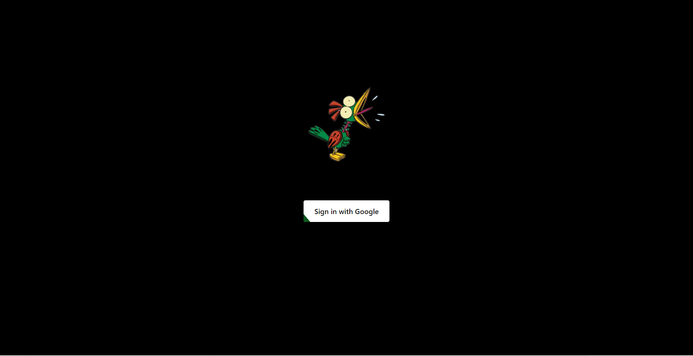
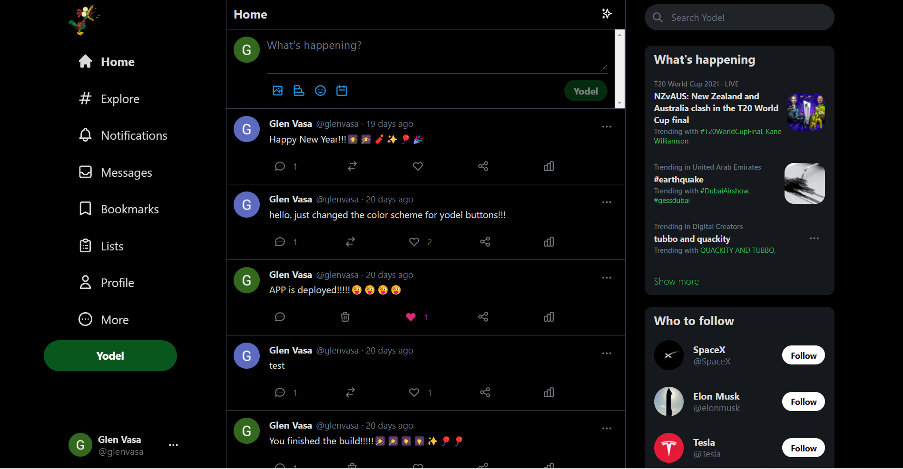
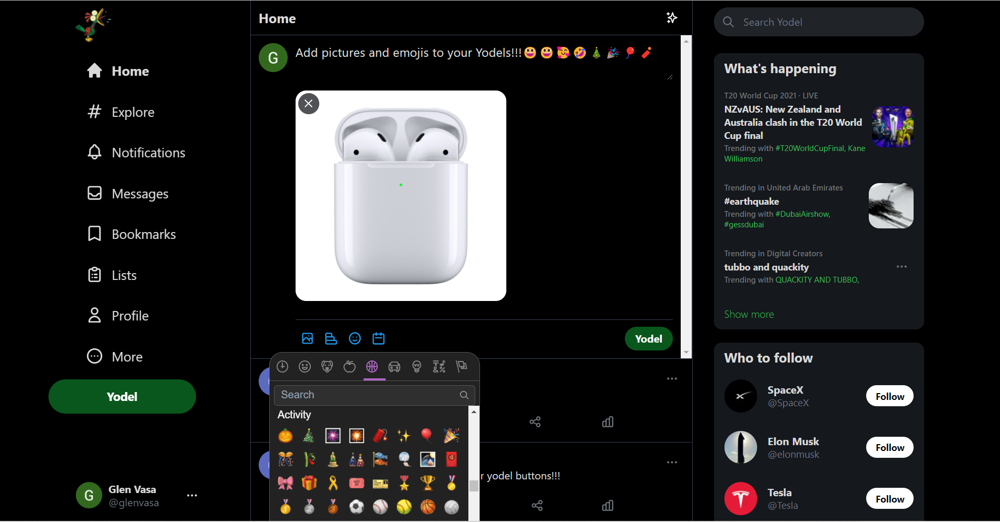
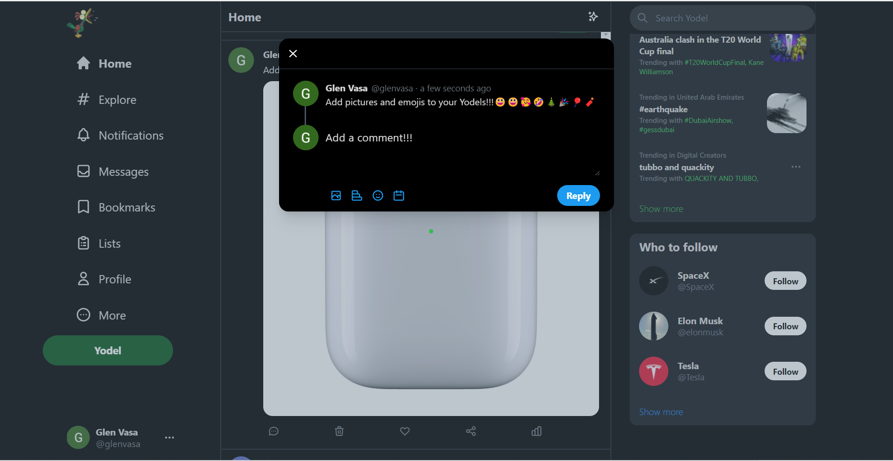
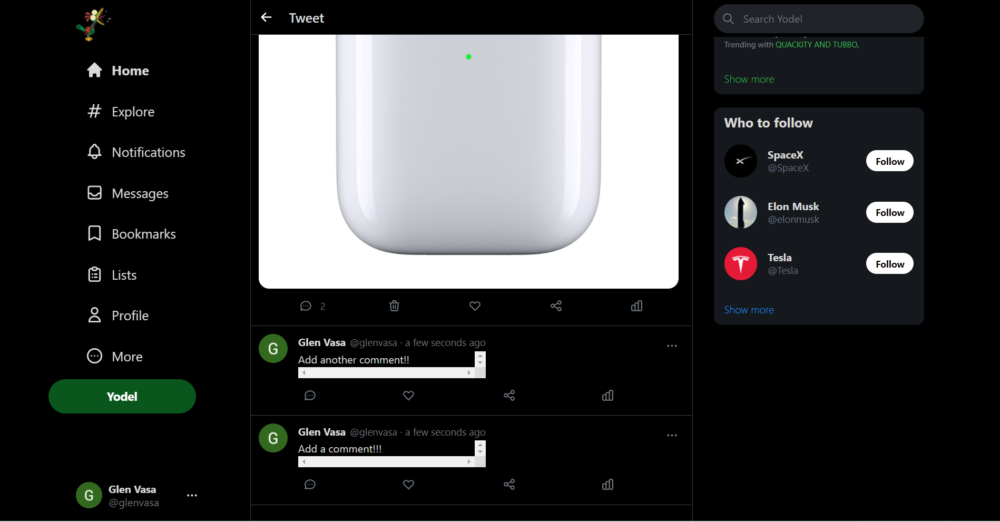

# Heroes & Villains

- Twitter-lite social media application 
- Developed with React.js, Next.js, NextAuth, Tailwind CSS, and Firebase v9. 
- Recoil used for global state management. 
- Google OAuth for login/authentication
- Users may send yodels (messages) that contain text, images, and emojis. 
- Users may "like" and "comment" on any yodel but may only "delete" their own.  

## Screenshots
  

## Deployed Application

- https://yodel-nine.vercel.app/
